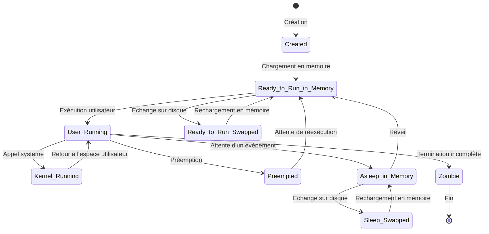

```mermaid
stateDiagram-v2
  [*] --> Created : Création
  Created --> Ready_to_Run_in_Memory : Chargement en mémoire
  Ready_to_Run_in_Memory --> User_Running : Exécution utilisateur
  User_Running --> Kernel_Running : Appel système
  Kernel_Running --> User_Running : Retour à l'espace utilisateur
  User_Running --> Preempted : Préemption
  Preempted --> Ready_to_Run_in_Memory : Attente de réexécution
  Ready_to_Run_in_Memory --> Ready_to_Run_Swapped : Échange sur disque
  Ready_to_Run_Swapped --> Ready_to_Run_in_Memory : Rechargement en mémoire
  User_Running --> Asleep_in_Memory : Attente d'un événement
  Asleep_in_Memory --> Sleep_Swapped : Échange sur disque
  Sleep_Swapped --> Asleep_in_Memory : Rechargement en mémoire
  Asleep_in_Memory --> Ready_to_Run_in_Memory : Réveil
  User_Running --> Zombie : Termination incomplète
  Zombie --> [*] : Fin
```